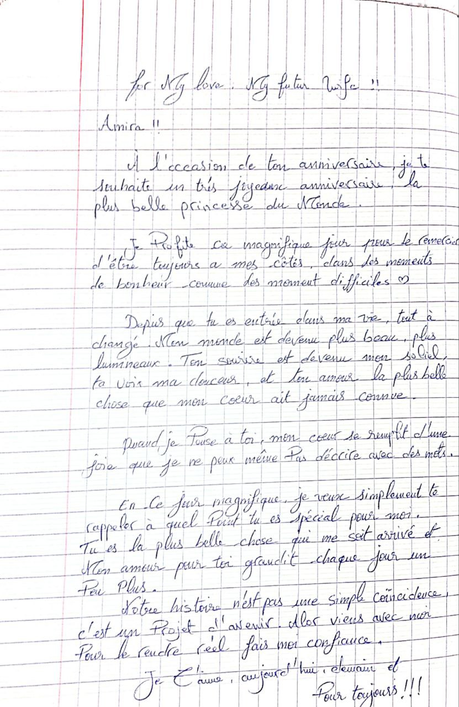

<!DOCTYPE html>
<html lang="fr">
<head>
<meta charset="UTF-8">
<meta name="viewport" content="width=device-width, initial-scale=1.0">
<title>Anniversaire Amira ❤️</title>

<link href="https://fonts.googleapis.com/css2?family=Poppins:wght@300;600&family=Dancing+Script:wght@600&display=swap" rel="stylesheet">

</head>

<body>

<header>

❤️

<h1>Joyeux anniversaire Amira ❤️</h1>

Mon amour, chaque instant avec toi est magique

</header>

<h3>🔒 Espace privé</h3>
<input type="password" id="password" placeholder="password">
 
<button onclick="checkPassword()">Entrer 💕</button>

<h3>💌 Lettre pour toi</h3>

Mon amour Amira ❤️  
Depuis notre rencontre le 31 août 2025,  
mon cœur ne bat que pour toi.  
Chaque jour avec toi est un cadeau.  
Je t'aime plus que tout al3mer wlh
hacha kmi ivghigh hacha itmennigh 
a3zouzou ynu. 

<!-- proposition -->

<h2>💍 Question importante</h2>

Amira ❤️ veux-tu être ma femme ?

<button id="yesBtn">OUI</button>
<button id="noBtn">NON</button>

💍

<h2>🎉 Surprise 🎉</h2>

1

7

<button onclick="lightCandles()">Allumer les bougies 🕯️</button>
 
<button onclick="showGift()">Claim your gift 🎁</button>
 

<audio id="birthday-music" src="birthday.mp3"></audio>
<audio id="final-music" src="happy-birthday.mp3"></audio>

<footer>
<h3>💞 Notre histoire</h3>

Tout a commencé le <b>31 août 2025</b>.  
Depuis ce jour, chaque moment avec toi est devenu précieux.  
Chaque rire, chaque message, chaque appel a construit notre histoire.  
Et aujourd'hui je veux simplement te dire que je suis heureux de t’avoir dans ma vie.

Avec tout mon amour pour toi Amira ❤️

</footer>

</body>
</html>
